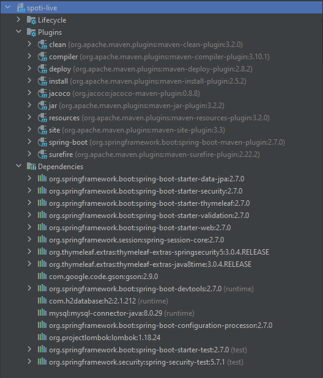
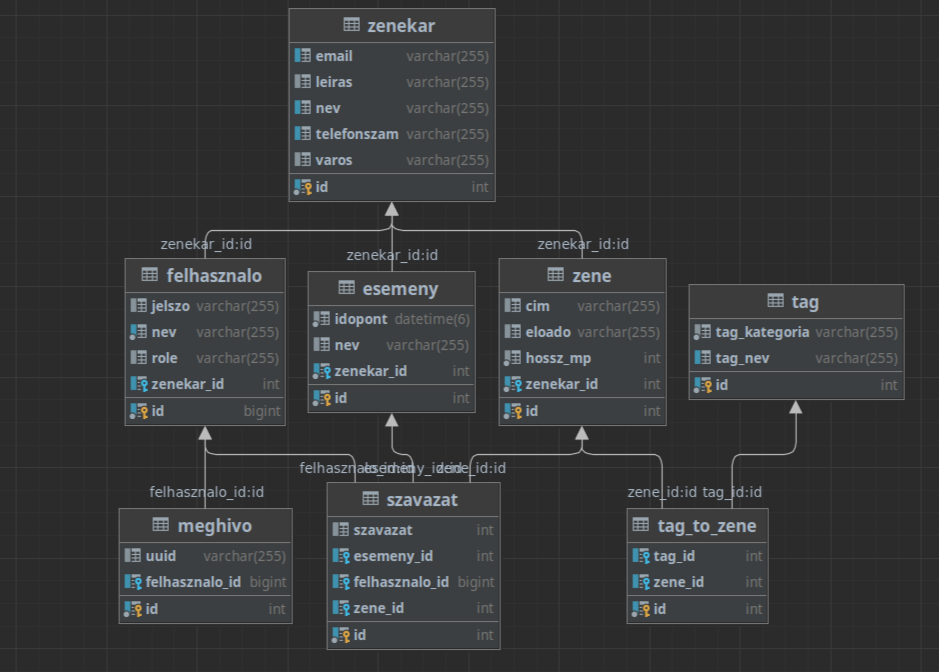

 

# Spoti live

Projekt Bemutatása:

A Spotilive egy olyan webalkalmazás, amelynek segítségével egy zenei rendezvény résztvevője valós
időben, interaktív kapcsolatot létesíthet a műsor szolgáltatójával. Így lehetőséget kap arra a felhasználó, 
hogy a saját ízlése szerint alakíthassa a műsorrendet, a zenei szolgáltató pedig a beérkező adatok alapján kaphat 
segítséget a műsorfolyam valós időben történő fejlesztésére. 
A közönség aktuális kollektív hangulatának és az előadó műsorszerkesztési elveinek az összehangolását 
a csatolt metronómok spontán szinkronizációja kísérlet ihlette. (https://prezi.com/mgudipakeygp/csatolt-metronomok-spontan-szinkronizacioja/)

A fejlesztési idő első hónapja alatt csapatunknak sikerült egy olyan minimal value fázist elérnie, amely már képes
komplex adatbáziskezelésen keresztül a különböző felhasználói szerepek hatékony és biztonságos kiszolgálására.
Jövőbeni tervünk, hogy folytatjuk az alkalmazás fejlesztését, egyrészt a Java és a Spring keretrendszer mélyebb megértése érdekében
és azért is, hogy felidézzük a bootcamp szuper emlékeit.

A Spotilive az alábbi linken kipróbálható:
- link

Tomi semi-őszínte mosolyának magyarázata az, hogy a html nem akar neki szót fogadni, pedig a service és controller rétegek jól működnek.
#backend

Futattási követelmények:
- Java Version : 17
- Docker (adatbázisok futtatásához)
- Maven
- 

Adatbázis: 

Hogyan fordul a program?

-

Hogyan kell futattni a programot?

-

Projekt tagok:
- Somogyi András : https://www.linkedin.com/in/andr%C3%A1s-somogyi-9b9a87240/
- László Tamás : -
- Kugler Tamás : https://www.linkedin.com/in/tam%C3%A1s-kugler-40ba04240/
- Takács Ákos : https://www.linkedin.com/in/%C3%A1kos-tak%C3%A1cs-99ba03240/
- Horváth Márton : https://www.linkedin.com/in/m%C3%A1rton-antal-horv%C3%A1th-3a8a84240/
- Nagy Andrea : -
